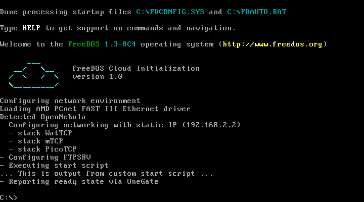

# FreeDOS to Cloud

This **prototype** aims to create a tool to initialize the FreeDOS-based VMs for running in the cloud, similarly as [cloud-init](https://cloud-init.io) or [Ignition](https://coreos.github.io/ignition/) projects on Linux. I.e., configure networking, start custom scripts and services on boot or call back home.

Why? Maybe somebody still has an old DOS server machine, which can be easily moved into the cloud. Or, maybe one uses FreeDOS, and having the network functional without pain to push data from/to DOS machine via rsync/FTP/HTTP would simplify the workflow. Or, just because even legacy systems still deserve a little love :heart:.

This repository contains

- FreeDOS Cloud Initialization Scripts
- Packer templates and Makefile to build a cloud-ready FreeDOS image

Scripts build *release candidate* (RC) of upcoming FreeDOS 1.3!

## Build

Requirements:

- `make`, `curl`, `unzip`
- [packer](https://www.packer.io)

To build a cloud-ready FreeDOS image, type:

```
make
```

If build succeeds, you'll find the image in `build/image/freedos-1.3.qcow2`.

## Supported Clouds

Functionality is currently limited only to [OpenNebula](https://opennebula.io).

Open an [issue](https://github.com/vholer/freedos2cloud/issues) in case of interest in other platforms.

### OpenNebula

Features

- KVM hypervisor only
- network configuration
  - NIC models: `pcnet`, `rtl8139`
  - only the first NIC is configured (`ETH0_`)
  - supports both static IP configuration and DHCP (if `ETH0_METHOD="dhcp"`)
- runs script (BAT) base64 encoded (`START_SCRIPT_BASE64`)
- reports VM readiness via OneGate to OpenNebula
- optionally configures and runs
  - FTP server ([mTCP FTPSrv](http://www.brutman.com/mTCP/mTCP_FTPSrv.html))
  - HTTP server ([mTCP HTTPServ](http://www.brutman.com/mTCP/mTCP_HTTPServ.html))
  - Telnet server ([RMENU](https://www.bttr-software.de/products/jhoffmann/#rmenu))



Full VM template example:

```
NAME = "freedos"
CONTEXT = [
  NETWORK = "YES",
  REPORT_READY = "YES",
  START_SCRIPT_BASE64 = "ZWNobyAuLi4gVGhpcyBpcyBvdXRwdXQgZnJvbSBjdXN0b20gc3RhcnQgc2NyaXB0IC4uLg==",
  SVC_FTP_ENABLE = "yes",
  SVC_FTP_PASSWORD = "root",
  SVC_FTP_SANDBOX_DIR = "/drive_c/",
  SVC_FTP_USERNAME = "root",
  TOKEN = "YES" ]
CPU = "1"
MEMORY = "256"
DISK = [
  IMAGE = "freedos-1.3",
  DEV_PREFIX = "hd"]
NIC = [
  NETWORK = "private",
  MODEL = "pcnet" ]
GRAPHICS = [
  LISTEN = "0.0.0.0",
  TYPE = "VNC" ]
```

#### Start Script

Custom BAT script provided in contextualization data is executed on every VM boot. The BAT script content must be provided in context parameter `START_SCRIPT_BASE64` on a **single unwrapped line** and base64 encoded!

Example:

```
CONTEXT = [
  START_SCRIPT_BASE64 = "ZWNobyAuLi4gVGhpcyBpcyBvdXRwdXQgZnJvbSBjdXN0b20gc3RhcnQgc2NyaXB0IC4uLg==",
  ...
]
```

for a simple script

```
echo ... This is output from custom start script ...
```

#### FTP Server

Supported context parameters

- `SVC_FTP_ENABLE="yes"` to run FTP server on boot
- `SVC_FTP_USERNAME` with FTP user
- `SVC_FTP_PASSWORD` with FTP password
- `SVC_FTP_SANDBOX_DIR` with FTP root directory in format `/drive_$X/$PATH` (e.g., `/drive_c/TEMP`)
- `SVC_FTP_UPLOAD_DIR` with FTP upload directory relative to `SVC_FTP_SANDBOX_DIR`,  defaults to `[any]`
- `SVC_FTP_PERMISSIONS` with FTP permissions, defaults to `all`

Consult the [mTCP FTPSrv](http://www.brutman.com/mTCP/mTCP_FTPSrv.html) documentation.

Example:

```
CONTEXT = [
  SVC_FTP_ENABLE = "yes",
  SVC_FTP_USERNAME = "root",
  SVC_FTP_PASSWORD = "root",
  SVC_FTP_SANDBOX_DIR = "/drive_c/",
  ...
]
```

#### HTTP Server

Supported context parameters

- `SVC_HTTP_ENABLE="yes"` to run HTTP server on boot
- `SVC_HTTP_CLIENTS` number of clients
- `SVC_HTTP_DIR_INDEXES="yes"` to enable directory indexes
- `SVC_HTTP_DOC_ROOT` path with document root (e.g., `C:\`)
- `SVC_HTTP_PORT` custom HTTP port

Consult the [mTCP HTTPServ](http://www.brutman.com/mTCP/mTCP_HTTPServ.html) documentation.

Example:

```
CONTEXT = [
  SVC_HTTP_ENABLE = "yes",
  SVC_HTTP_DOC_ROOT = "C:\ ",
  SVC_HTTP_DIR_INDEXES = "yes",
  ...
]
```

#### Telnet Server

> :warning: WARNING: [RMENU](https://www.bttr-software.de/products/jhoffmann/#rmenu) allows to access the DOS machine via telnet protocol, which is **not encrypted**. Also, RMENU doesn't support authentication, thus anyone who connects can control the machine. Don't enable telnet on untrusted networks OR restrict access to port 23 of VM in your cloud management tools! :warning:

Supported context parameters

- `SVC_RMENU_ENABLE="yes"` to run RMENU on boot

Example:

```
CONTEXT = [
  SVC_RMENU_ENABLE="yes",
  ...
]
```

